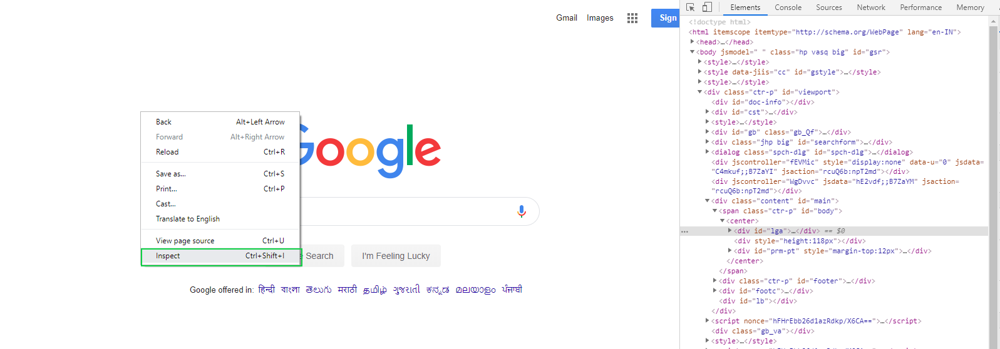
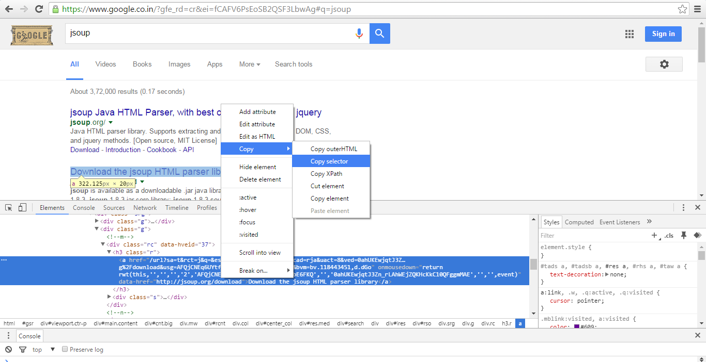

# What are Web Elements.
• Elements are basically HTML tags.

• Selenium interacts with these HTML tags.

### How to find HTML tags on a webpage?
• In order to find HTML tags open an webpage, right click on the element and go to inspect.


• Below is the example inspect element of input tag.
```commandline
<input type="email" class="whsOnd zHQkBf" jsname="YPqjbf" autocomplete="username" spellcheck="false" tabindex="0" aria-label="Email or phone" name="identifier" autocapitalize="none" id="identifierId" dir="ltr" data-initial-dir="ltr" data-initial-value="">
```

# Locators
• In order to locate elements Selenium provides 8 technique called locators.

1) **ID**- First preference should go to ID to handle elements.
2) **Name**- If it is present, can be used as a locator.
3) **cssSelector**- Need to be generated. Always will be present in any HTMS tags.
4) **xpath**- Need to be generated. Always will be present in any HTMS tags.
5) **tagName**- Depends on uniqueness
6) **className**- Class name of the HTML tag
7) **linkText**- The link text locator matches the text inside the anchor tag.
8) **partialLinkText**- The partial link text locator matches the text inside the anchor tag partially.

### For below Html tag
```commandline
<input type="email" class="whsOnd zHQkBf" jsname="YPqjbf" autocomplete="username" spellcheck="false" tabindex="0" aria-label="Email or phone" name="identifier" autocapitalize="none" id="identifierId" dir="ltr" data-initial-dir="ltr" data-initial-value="">
```
1) **ID**- identifierId
2) **Name**- identifier
3) **cssSelector**- #identifierId
4) **xpath**- //*[@id="identifierId"]
5) **tagName**- input
6) **className**- whsOnd zHQkBf
7) **linkText**- NA
8) **partialLinkText**- NA

# For using locators
• Import "By"
```commandline
from selenium.webdriver.common.by import By
```
# Locator- ID
• 2 ways can be used.
1) By assigning variable.
```commandline
user_name= driver.find_element(By.ID, "user-name")
user_name.send_keys("Selenium@python.com")
pass_word = driver.find_element(By.ID, "password")
pass_word.send_keys("Learning")
```
2) Directly
```commandline
driver.find_element(By.ID, "user-name").send_keys("Selenium@python.com")
driver.find_element(By.ID, "password").send_keys("Learning")
```

# Locator- cssSelectors, xpath
• cssSelector and xpath can be copied from inspect element.
• Right click on the HTML element and select inspect.
• Right click again on the HTML tag in the inspect element and go to copy.

#### Example


```commandline
driver.find_element(By.XPATH, "//*[@id='login-button']").click()
```


# Full source code

```commandline
from selenium import webdriver
from selenium.webdriver.edge.service import Service
from selenium.webdriver.common.by import By
import time

edge_path = "Selenium-learning/Webdriver File/msedgedriver.exe"  # Webdriver path
service = Service(executable_path= edge_path)

driver = webdriver.Edge(service= service)

# It is an online automation testing website. Web element of writing username is used for this code,
driver.get("https://www.saucedemo.com/")
driver.maximize_window()

# Using locator- ID
# user_name= driver.find_element(By.ID, "user-name")
# user_name.send_keys("Selenium@python.com")
# pass_word = driver.find_element(By.ID, "password")
# pass_word.send_keys("Learning")

driver.find_element(By.ID, "user-name").send_keys("Selenium@python.com")
driver.find_element(By.ID, "password").send_keys("Learning")

# Using locator- xpath
# Using xpath of the login button
driver.find_element(By.XPATH, "//*[@id='login-button']").click()

time.sleep(5) #Adding a delay
driver.quit()
```