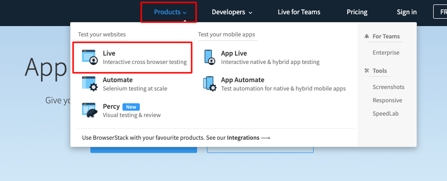

# Handling Mouseover Event

• Mouse over event is used interacting pointer device with web elements like drop down list.



• This action can be perform by importing ActionChains.
```commandline
from selenium.webdriver.common.action_chains import ActionChains
```

# Process 
• Locate the drop down option and copy the Xpath.

• Using actionchains we move the pointer operation to that xpath.

• Again locating any option from drop down list we can click the element.

```commandline
# Locate the drop down list
menu_options = driver.find_element(By.XPATH, "/html/body/div[1]/header/div/div[1]/div[3]/div/a[2]/div/span")
do_action = ActionChains(driver)
do_action.move_to_element(menu_options).perform()
time.sleep(5)
driver.find_element(By.XPATH, "/html/body/div[1]/header/div/div[3]/div[2]/div[2]/div/div[1]/div/a/span").click()
time.sleep(5)
```

# Full Source code

```commandline
from selenium import webdriver
from webdriver_manager.microsoft import EdgeChromiumDriverManager
from selenium.webdriver.common.by import By
from selenium.webdriver.edge.service import Service
from selenium.webdriver.common.action_chains import ActionChains
import time

driver = webdriver.Edge(service= Service(EdgeChromiumDriverManager().install()))
driver.get("https://www.amazon.com/")
driver.implicitly_wait(20)
driver.maximize_window()

# Locate the drop down list
menu_options = driver.find_element(By.XPATH, "/html/body/div[1]/header/div/div[1]/div[3]/div/a[2]/div/span")
do_action = ActionChains(driver)
do_action.move_to_element(menu_options).perform()
time.sleep(5)
driver.find_element(By.XPATH, "/html/body/div[1]/header/div/div[3]/div[2]/div[2]/div/div[1]/div/a/span").click()
time.sleep(5)
```