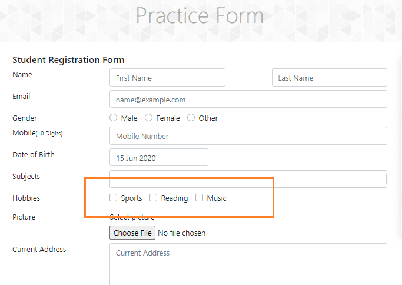

# Handling checkboxes

• Checkboxes is an element that allows useer to make certain decision.



• We have to copy the web slement, in this code we are taking Xpath.

• Use **".click"** to check the box.
```commandline
driver.find_element(By.XPATH, "/html/body/div/div/form/div[3]/div[1]/label/input").click()
```
• For testing multiple checkboxes we can use **"find_elements"**, and identify the common web elements for checkboxes.
# Full Source code
```commandline
from selenium import webdriver
from webdriver_manager.microsoft import EdgeChromiumDriverManager
from selenium.webdriver.common.by import By
from selenium.webdriver.edge.service import Service
import time

driver = webdriver.Edge(service= Service(EdgeChromiumDriverManager().install()))
driver.get("https://demo.applitools.com/")
driver.maximize_window()
driver.implicitly_wait(5)

driver.find_element(By.XPATH, "/html/body/div/div/form/div[3]/div[1]/label/input").click()

time.sleep(4)
driver.quit()
```