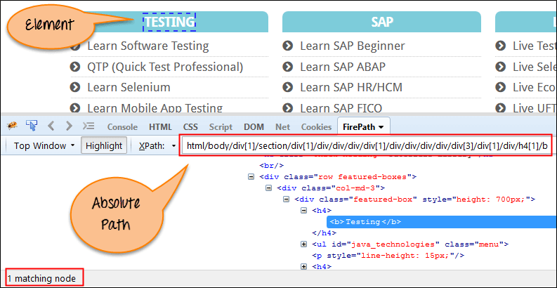
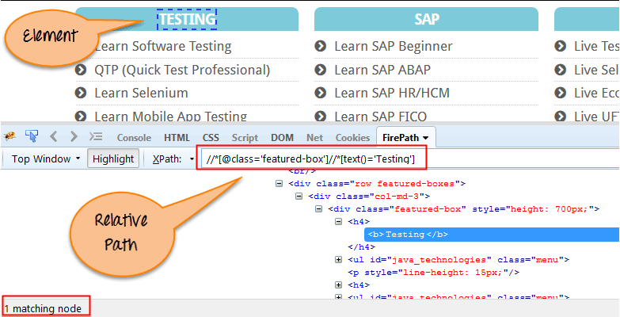
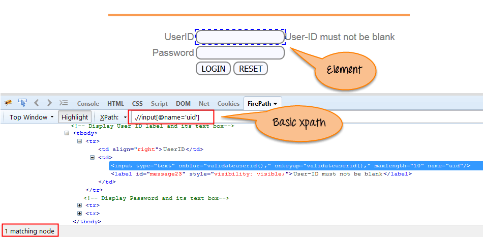
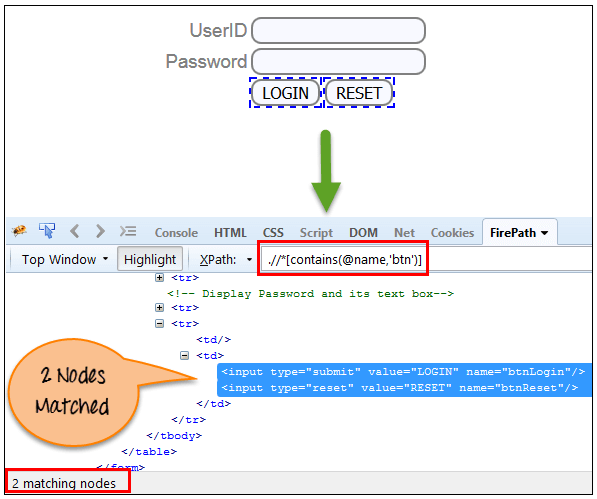
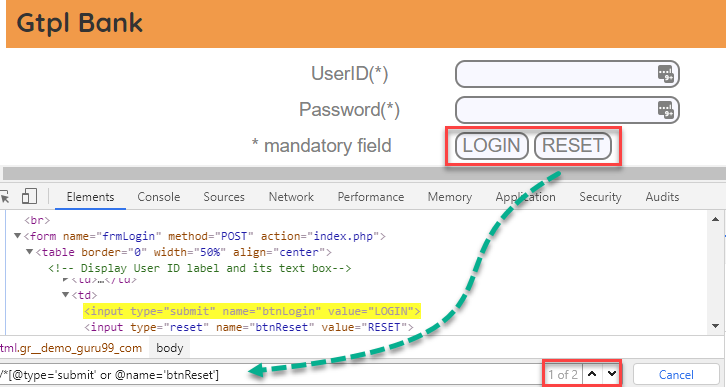
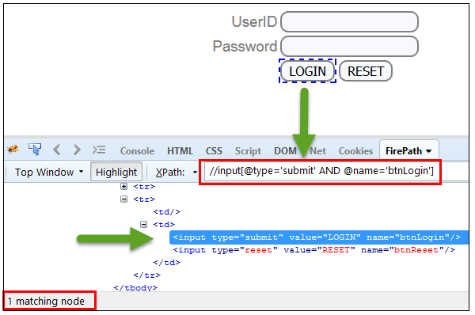
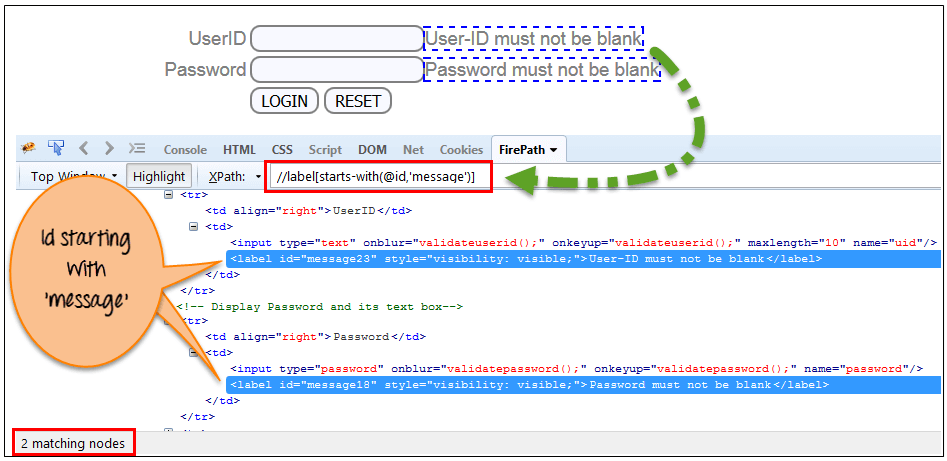
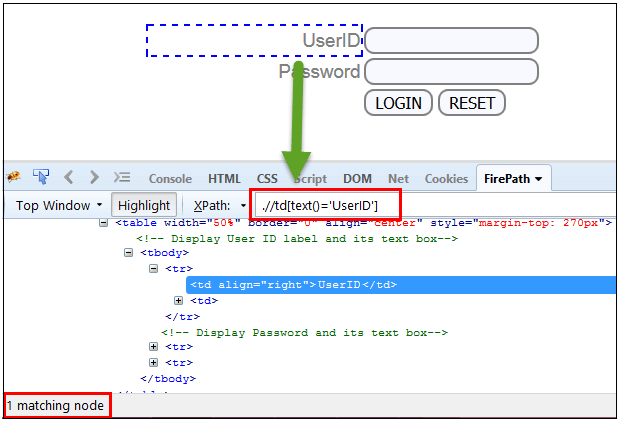

# Xpath and CSS Locators

### What is the Xpath
• Xpath is a XMP path used for naviagaation through the HTML structure of the page.

• It is used to find any web element on a web page.

### XPath Syntax

````commandline
Xpath=//tagname[@attribute='value']
````
**"//"-** Select the current node

**"tagname"-** Web element like input,div, img etc

**"@"-** Select Attribute.

**"Attribute"-** Attribute Name

**"Value"-** Value of the attribute

#### To find the element on web pages accurately there are different types of locators:

| XPath Locators | Find different elements on web page                                                                  |
|----------------|------------------------------------------------------------------------------------------------------|           
| ID             | To find the element by ID of the element                                                             |
| Classname      | To find the element by Classname of the element                                                      |
| Name           | To find the element by name of the element                                                           |
| Link text      | To find the element by text of the link                                                              |
| XPath          | XPath required for finding the dynamic element and traverse between various elements of the web page |
| CSS path       | CSS path also locates elements having no name, class or ID. |


### Types of X-path

There are two types of XPath:

1) Absolute XPath

2) Relative XPath

#### Absolute XPath

• Dirext way to find the element.

• Disadvantage is that if there are any changes made in the path of the element then XPath gets failed.



#### Relative XPath

• It can search elements anywhere on the webpage, means no need to write a long xpath and you can start from the middle of HTML DOM structure.



#  Dynamic XPath In Selenium WebDriver

**1) Basic XPath**

It is expressed on the basis of web elements like ID, Name, Classname and it's value.



### Some more basic xpath expressions:
```commandline
Xpath=//input[@type='text']
Xpath=//label[@id='message23']
Xpath=//input[@value='RESET']
Xpath=//*[@class='barone']
Xpath=//a[@href='http://demo.guru99.com/']
Xpath=//img[@src='//guru99.com/images/home/java.png']
```
**2)  Contains()**

• Sometimes values of attributes changes dyanmically, contains used in Xpath expression.

• There are some value of attributes changes example login information.

```commandline
Xpath=//*[contains(@type,'sub')]
```



**3) Using OR & AND:**

In OR expression, two conditions are used, whether 1st condition OR 2nd condition should be true.


```commandline
Xpath=//*[@type='submit' or @name='btnReset']
```

In AND expression, two conditions are used, both conditions should be true 
```commandline
Xpath=//input[@type='submit' and @name='btnLogin']
```



**4) Xpath Starts-with:**

XPath starts-with() is a function used for finding the web element whose attribute value gets changed on refresh or by other dynamic operations on the webpage. In this method, the starting text of the attribute is matched to find the element whose attribute value changes dynamically.

```commandline
Xpath=//label[starts-with(@id,'message')]
```



**4) XPath Text() Function:**

• The XPath text() function is a built-in function of selenium webdriver which is used to locate elements based on text of a web element. 
```commandline
Xpath=//td[text()='UserID']
```

